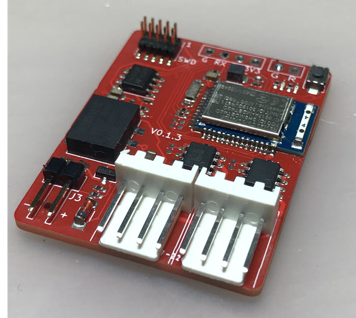
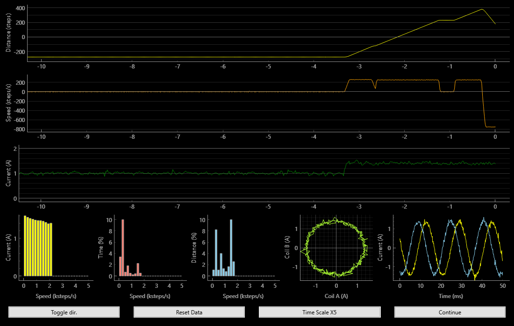
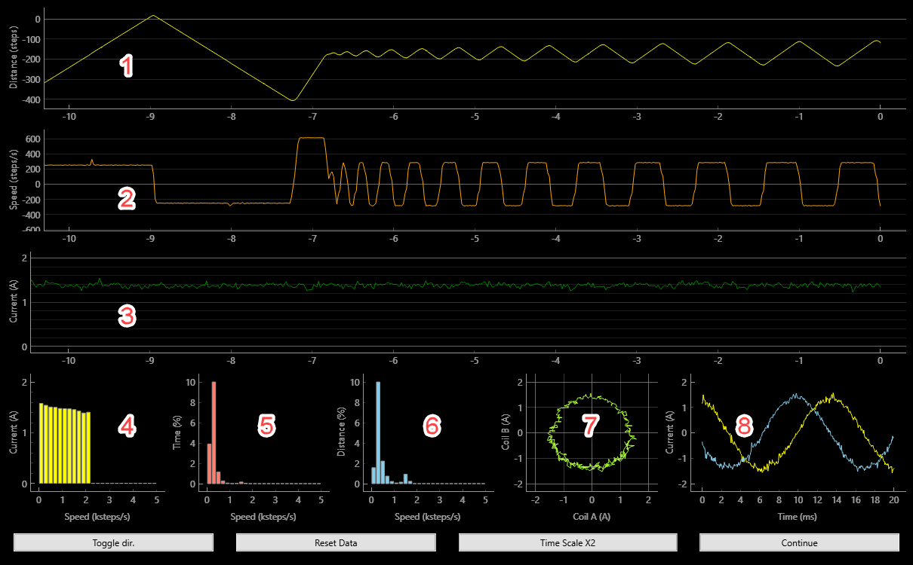

# BLE Stepper Motor Monitor

The BLE Stepper Monitor Analyzer is a variant of the Simple Stepper Motor Analyzer which replaces the touch screen LCD with a Bluetooth BLE radio link and a python app that provides the display or a desktop computer. This result in a smaller and less expensive board and a large display that leverages on the desktop computer capabilities.

## Highlights
* Open-source hardware, firmware, and software designs, with permissive license that allows commercial use and does not require attribution.
* A small and relatively inexpensive PCB that can be embedded in a 3D printer or CNC machine.
* Each PCB has a unique address and can be monitored individually.
* The PCB's can be ordered  from JLCPCB with all the parts preassembled, except for the the nrf52 BLE module that need to be soldered separately.
* The stepper motor is galvanically isolated from the analyzer's electronics which  minimizes potential interference or ground loops.
* The analyzer can be powered from any 4.5 to 30VDC source and consumes very little power, about 50mw. Even a single 9V battery can power it for many hours. Power is required only when monitoring the stepper and the stepper can be operates safely even if the PCB is not powered.

## Caveats
* At this time, updating the PCB firmware requires a programmer. Normally it can be an inexpensive Segger JLink EDU Mini, which as of Aug 2022 are unavailable due to the global supply chain shortage. A more expensive alternative is the Nordic nRF52832 DK which can act also as a Segger programmer.
* The two current sensor ICs that are available from JLCPCB have higher noise than the Alegro GMR sensors. However, the analyzer functions properly with the noisier sensors as well.
* As of Aug 2022, the python application requires some TLC, for example to recover gracefully if a wireless connection lost. However, it is fully functional and was tested on Windows and Mac OSX.
* The PCB can be built with two versions of the BLE module, one with an internal antenna and one with a U.FL connector for an external antenna. Internal antennas are 
more compact but may be insufficient with shielded 3D printers.

## Installing the PCB

* IMPORTANT: Always turn power off before connecting or disconnecting the PCB or the stepper motor.
* Connect a voltage of 4.5VDC t0 30VDC to the connector J3. Pay attention to polarity though the PCB is protected against reversed polarity. Verify that one red LED is solid while the other blinks slowly.;
* With the PCB energized and the **stepper not connected yet to the board** long press on the PCB button until the yellow LED will blink. Make sure the LED blinked exactly 3 times. This will calibrate the zero current of the sensors.
* With power off, connect the 4 wires of your stepper motor through the board such that one connector with four wires is connected to your controller and the other is connected to the stepper. The PCB is arranged such that the 4 connector pins from left to right are connected pass-through to their respective pins on the other connector. Also, the two connector are interchangeable such that each can act as an input or an output.
* Turn power on and verify that your machine functions properly and that the direction of the stepper is correct. That is, the wiring should not reverse the direction of the stepper.

## Installing and running the Python application.

1. Download the python directory this github repository.
1. Install python3 on your computer. Follow the Python installation instructions for your operating system. The analyzer requires Python 3.7 or latter but prefer the latest available python. 
1. Identify the *python* and *pip* command on your computer. On some computers they can be *python* and *pip* respectively and on others something like *python3.10& and *pip3.10* respectively. From now on we will refer to them as *python* and *pip* but replace with the actual command names as needed.
1. Verify the version of your python by running the command: **python --version**. Verify that the printed version number is at least 3.7.
1. With the PCB powered, Run the command  *python3 scanner_main.py*, after a few seconds, it will print a list of BLE devices it found. One of them should have the name that looks like STP-XXXXXXXXXXXX. Note the device
address that is printed before that name. We will use it later to access
the device.
1. Run the command **python analyzer_main.py -d <device-address>** where <device-address> is the device address you identified in the previous step. If you get errors about missing python modules such as **bleak**, install them using the pip command and try again. You can also use the
**requirements.txt** file to install all missing modules at once.
1. If everything went well, the analyzer_main.py application will connect to the device and shows its data in real time.

## Understanding the data
The screenshot below shows the 8 data items that are monitors. The data can be reset using the **Reset** button and can be paused/played using the **Pause/Continue** button. 

1. Step counter over time. If the direction of the counting is opposite to what you would like, click on the **Toggle Dir** button. This will not effect the stepper motor but will count in the opposite direction.
2. Speed in steps/sec over time. This value is the derivative of the step counter above.
3. Stepper current in Amps over time. This value is computed as *sqrt(A^2 + B^2)* where A and B are the momentary currents in Amps in coils A, B respectively, and it represents the peak currents in each of the coils.
4. Coil peak current vs speed. This histogram shows the stepper current in different speeds. Ideally all speeds should have about the same current but too high inductance or too lower supply voltage may result in current and torque degradation in higher speeds.
5. Distance vs speed. This histogram shows in what speeds the stepper made the most distance (steps or revolutions)
6. Time vs speed. This histogram shows in what speeds the stepper was most of the time.
7. Phase pattern. This graph shows the 'cleanness' of the signal in the stepper coil. Every second of two the analyzer captures the signals in graph 8 and shows their pattern also in graph 7. Ideally graph 7 would be a circle center around the 0,0 point and its radius is the peak current set for the stepper.
8. Oscilloscope graph. This graph shows current patterns captures periodically from the two coils and ideally they should look like clean sin/cosine graphs with magnitude equal to the stepper peak current. Every cycle of the sin/cosine graph represent 4 full stepper steps. If the stepper speed is too fast or two slow to show the signals, use the Time Scale button to speed up or slow down the signal capture.

## Building your own BLE Stepper Motor Analyzer

* The three production files for JLCPCB SMD service are available under the kicad directory. This will allow you to get fully populated boards except for the BLE module.
* Solder a Raytac nrf52832 BLE module. You can use MDBT42Q-512KV2 (internal antenna) or MDBT42Q-U512KV2 (U.FL connector for an external antenna).
* Flash the board with the firmware using a compatible SWD programmer. We are using Segger's JLink with a Segger Edu Mini programmer or if this is not available, a Nordic NRF52-DK which can act also as a JLink programmer. Use a standard 2x5 pins 0.05" pitch SWD cable.
* Zero calibrate the sensors as explained above. 

## Modifying the firmware

* The source code of the firmware is available in this github repository under the platformio folder. Open that folder with the platformio IDE (a plugin for VSCode) and your project is ready.
* The PCB has a serial output for debugging. You can connect there a 115200 baud 3.3v serial/USB and view the output.
* To program the PCB use a Segger compatible debugger such as Segger Edu Mini, or Nordic nrf52 DK board. This will also allow you to debug the program, set breakpoints, single step and so on.

## FAQ

Q: Can I use this open source design in commercial products?

A: Yes, and you are welcome to do so, and attribution is not needed.

-----

Q: Can I operate the printer with the PCB connected but not powered or not monitored?

A: Yes. The electronics and the stepper are isolated from each other.

----

Q: How much does it cost to build the PCB?

A: Depending on quantities. For a batch of 30, JLCPCB changes about $7 per assembled board and then you need to add the Raytac BLE module which costs about $9. This brings the unit cost to less than $20, as of Aug 2022.

----

Q: If you would redesign it from scratch, what would you do differntly?

A: The main change would be to use ESP32 instead of the Raytac/Nordic module and this is for several reasons:

* It's less expensive.
* It has better support for firmware upgrade by the user.
* It's available from JLCPCB's SMD assembly service.

The Nordic nrf52 was selected for it's low power, with the intention to power the PCB by harvesting stepper motor power, but that requirement was dropped at a latter stages of the project.

-----

Q: How does this differs from the Simple Stepper Motor analyzer?

A: Some of the differences are:

* The lack of builtin display makes this analyzer more compact and less expensive.
* The Simple Stepper Motor analyzer is self contained with display while this one is intended to be buried in a 3D printer, using a computer for the display.
* The Simple Stepper Motor Analyzer uses a Raspberry Pi Pico processor while this one uses Nordic nRF52832.
* The Simple Stepper Motor Analyzer samples the signal at 100Khz while this one samples at 40Khz due to the limitations of the nRF52832. This however doesn't seem to matter.
* The Simple Stepper Motor Analyzer displays each graph on screen of its own while this one displays all the graphs at once.
* Having the display on a computer makes it easier to graph screenshots, for example, to post in diagnostics discussions in 3D printer forums.
